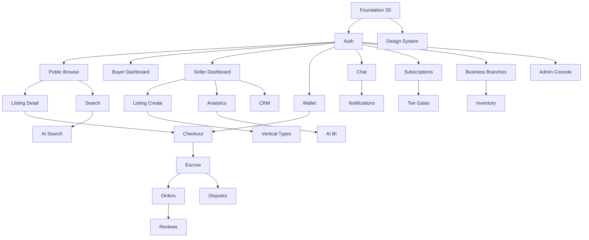
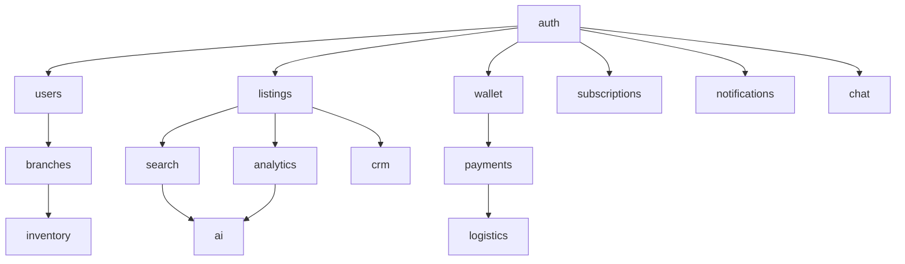

# Velontri Execution Plan

**Document version:** 1.0.0  
**Status:** Approved for execution — planning only (no application code)  
**Last updated:** June 22, 2026  
**References:** `docs/PRD.md` v1.2.0 · `docs/FRONTEND_ARCHITECTURE.md` v1.0.0  
**Backend:** Complete (403/403 tests, gateway `http://localhost:8000/api/v1`)  
**Frontend:** Scaffold only — full build begins per this plan  

---

## Document Index

| # | Section | Page |
|---|---------|------|
| 1 | [Complete Project Roadmap](#1-complete-project-roadmap) | ↓ |
| 2 | [Development Phases](#2-development-phases) | ↓ |
| 3 | [Sprint Breakdown](#3-sprint-breakdown) | ↓ |
| 4 | [Feature Dependencies](#4-feature-dependencies) | ↓ |
| 5 | [Module Dependencies](#5-module-dependencies) | ↓ |
| 6 | [Frontend Implementation Order](#6-frontend-implementation-order) | ↓ |
| 7 | [Backend Integration Order](#7-backend-integration-order) | ↓ |
| 8 | [Testing Strategy](#8-testing-strategy) | ↓ |
| 9 | [Deployment Strategy](#9-deployment-strategy) | ↓ |
| 10 | [Launch Strategy](#10-launch-strategy) | ↓ |
| A | [Page-by-Page Build Order](#appendix-a-page-by-page-build-order) | ↓ |
| B | [Task Hierarchy (Jira / Linear / GitHub)](#appendix-b-task-hierarchy) | ↓ |
| C | [Dependency Graph](#appendix-c-dependency-graph) | ↓ |
| D | [Risk Analysis](#appendix-d-risk-analysis) | ↓ |
| E | [Release Plan](#appendix-e-release-plan) | ↓ |

**Complexity legend:** S = 1–2 days · M = 3–5 days · L = 5–8 days · XL = 8–13 days (per engineer)

---

## 1. Complete Project Roadmap

### 1.1 Timeline Overview (24 weeks / 12 sprints)

```
Week  1–2   Sprint 0   Foundation + API layer
Week  3–4   Sprint 1   MVP: Public browse + Auth
Week  5–6   Sprint 2   MVP: Buyer core + Wallet
Week  7–8   Sprint 3   MVP: Seller core + Escrow checkout
Week  9–10  Sprint 4   Phase 2: Marketplace expansion (verticals)
Week 11–12  Sprint 5   Phase 2: Search + Chat + Notifications
Week 13–14  Sprint 6   Phase 2: Reviews + Stores + Logistics
Week 15–16  Sprint 7   Phase 3: Analytics + Subscriptions
Week 17–18  Sprint 8   Phase 3: Inventory + Multi-branch
Week 19–20  Sprint 9   Phase 3: CRM + Agent tools
Week 21–22  Sprint 10  Phase 4: Admin + AI BI
Week 23–24  Sprint 11  Phase 4: QA hardening + Staging
Week 25–26  Sprint 12  Launch + Post-launch monitoring
```

### 1.2 Milestone Map

| Milestone | Target | Exit criteria |
|-----------|--------|---------------|
| **M0 — Foundation** | End Sprint 0 | API client, design system, auth shell, CI scaffold |
| **M1 — MVP Alpha** | End Sprint 3 | Guest browse, auth, buyer wallet, seller listings, escrow checkout |
| **M2 — Marketplace Beta** | End Sprint 6 | All listing verticals, chat, search, logistics tracking |
| **M3 — Business RC** | End Sprint 9 | Inventory, CRM, analytics, branches, subscriptions |
| **M4 — Enterprise RC** | End Sprint 10 | Admin console, moderation, disputes, AI BI |
| **M5 — Production Launch** | End Sprint 12 | E2E green, audit pass, staging → prod deploy |

### 1.3 Team Assumptions

| Role | Count | Focus |
|------|-------|-------|
| Frontend lead | 1 | Architecture, RBAC, API layer |
| Frontend engineers | 2–3 | Pages, components |
| QA engineer | 1 | Test automation from Sprint 2 |
| DevOps (part-time) | 0.5 | CI/CD from Sprint 0 |
| Product (part-time) | 0.5 | Acceptance per sprint |

Backend team: **maintenance only** — API frozen unless defect found.

---

## 2. Development Phases

### Phase 1 — MVP (Sprints 0–3, Weeks 1–8)

**Goal:** End-to-end commerce loop for buyer + seller in Nigeria (NGN).

| Feature | PRD Req | Complexity | Sprint |
|---------|---------|------------|--------|
| Project foundation (deps, Tailwind, shadcn, themes) | — | L | 0 |
| API integration layer (Axios, TanStack Query, interceptors) | 23 | L | 0 |
| Auth module (register, verify, login, refresh, middleware) | 1 | L | 0–1 |
| Public layout (Navbar, Footer, SEO shell) | 3, 8 | M | 1 |
| Home page | 3 | M | 1 |
| Listings browse + product detail | 3 | L | 1 |
| Search (keyword + filters) | 8 | L | 1 |
| Login / Register / Verify phone | 1 | M | 1 |
| Dashboard hub (role redirect) | 1, 2 | S | 1 |
| Buyer dashboard | 2, 12 | M | 2 |
| Buyer profile + settings | 2 | M | 2 |
| Wallet (balance, transactions, top-up) | 13, 24 | L | 2 |
| Seller dashboard | 3, 17 | M | 2 |
| Seller listing create (product) + edit | 3 | XL | 2–3 |
| Checkout + payment initiate | 12 | L | 3 |
| Escrow payment detail + confirm delivery | 12 | L | 3 |
| Buyer orders list | 12 | M | 3 |
| Legal pages (terms, privacy, about) | — | S | 3 |

**MVP release tag:** `v0.1.0-mvp`

---

### Phase 2 — Marketplace Expansion (Sprints 4–6, Weeks 9–14)

**Goal:** Full vertical marketplace + real-time engagement.

| Feature | PRD Req | Complexity | Sprint |
|---------|---------|------------|--------|
| Listing verticals: services, jobs, property, vehicles | 4–7 | XL | 4 |
| Type-specific detail pages (5 variants) | 4–7 | XL | 4 |
| Job application flow | 6 | M | 4 |
| Service booking flow | 7 | M | 4 |
| Property mortgage calculator + map | 4 | M | 4 |
| Vehicle VIN + inspection UI | 5 | M | 4 |
| AI natural-language search | 8, 9 | L | 5 |
| Voice search UI | 8 | M | 5 |
| Search autocomplete | 8 | S | 5 |
| WebSocket chat (threads, messages, media) | 10 | XL | 5 |
| Notification centre + preferences | 21 | L | 5 |
| Reviews + seller responses | 11 | L | 6 |
| Store pages + custom store profile | 3 | L | 6 |
| Logistics quote + shipment tracking | 16 | L | 6 |
| AI commerce assistant (full page) | 9 | L | 6 |
| Subscription tier catalog (public) | 20 | S | 6 |
| Multi-currency display (5 currencies) | 24 | M | 6 |

**Beta release tag:** `v0.2.0-beta`

---

### Phase 3 — Business Tools (Sprints 7–9, Weeks 15–20)

**Goal:** SME / multi-branch operations.

| Feature | PRD Req | Complexity | Sprint |
|---------|---------|------------|--------|
| Seller analytics dashboard | 17 | L | 7 |
| Analytics export (CSV/PDF) | 17 | M | 7 |
| Subscription management (upgrade/downgrade) | 20 | L | 7 |
| Invoices + FX display | 20, 24 | M | 7 |
| KYC upload + trust badges UI | 2 | L | 7 |
| Business + branch creation | 15 | L | 8 |
| Branch manager dashboard | 15 | L | 8 |
| Inventory stock table + SKU management | 14 | XL | 8 |
| Inter-branch transfers + damage | 14 | L | 8 |
| Barcode/QR display | 14 | S | 8 |
| Business owner cross-branch dashboard | 15, 17 | L | 8 |
| CRM customer list + detail + notes | 19 | XL | 9 |
| Agent dashboard + on-behalf listings | 2, 19 | L | 9 |
| Branch-scoped analytics | 17 | M | 9 |
| 2FA setup + device management | 1, 22 | M | 9 |
| Password reset flow | 1 | M | 9 |

**RC release tag:** `v0.3.0-rc`

---

### Phase 4 — Enterprise Features (Sprints 10–12, Weeks 21–26)

**Goal:** Platform operations, AI BI, production launch.

| Feature | PRD Req | Complexity | Sprint |
|---------|---------|------------|--------|
| Admin dashboard | 22, 23 | L | 10 |
| User management + role assignment | 2, 22 | L | 10 |
| Listing moderation queue | 3, 22 | L | 10 |
| Dispute resolution console | 12, 22 | L | 10 |
| Platform analytics (ops) | 17, 23 | M | 10 |
| AI Business Intelligence UI | 18 | XL | 10 |
| OAuth login (Google, Apple) | 1 | L | 10 |
| Enterprise subscription contracts | 20 | M | 10 |
| Full E2E test suite (40 flows) | 23 | XL | 11 |
| Accessibility audit (WCAG AA) | 23 | L | 11 |
| Performance optimization pass | 23 | L | 11 |
| Security audit + CSP headers | 22 | M | 11 |
| Staging deployment + smoke tests | 23 | M | 11 |
| Production deployment | 23 | M | 12 |
| Launch monitoring + runbooks | 23 | M | 12 |
| Post-launch defect buffer | — | L | 12 |

**GA release tag:** `v1.0.0`

---

## 3. Sprint Breakdown

### Sprint 0 — Foundation (Weeks 1–2)

| ID | Task | Owner | Complexity |
|----|------|-------|------------|
| S0-01 | Install frontend dependencies per architecture | FE Lead | S |
| S0-02 | Scaffold folder structure (`src/app`, `components`, `lib`, `features`) | FE Lead | M |
| S0-03 | Configure Tailwind + CSS design tokens + dark mode | FE | M |
| S0-04 | Initialize shadcn/ui primitives (Button, Input, Dialog, …) | FE | L |
| S0-05 | Implement Axios client + interceptors + error mapper | FE Lead | L |
| S0-06 | Implement TanStack Query client + query key factories | FE Lead | M |
| S0-07 | Generate/consume OpenAPI types from gateway | FE Lead | M |
| S0-08 | Auth session provider + cookie utilities | FE Lead | L |
| S0-09 | RBAC primitives (`Can`, `RoleGate`, `TierGate`) | FE Lead | M |
| S0-10 | Shared states: EmptyState, ErrorState, Skeleton, PageHeader | FE | M |
| S0-11 | Vitest + RTL + MSW test harness | QA | M |
| S0-12 | GitHub Actions: type-check, lint, unit tests | DevOps | M |
| S0-13 | Extend `middleware.ts` for full route tree | FE Lead | M |

**Sprint 0 deliverable:** Runnable dev environment; API health check from frontend; no user-facing pages beyond scaffold.

---

### Sprint 1 — Public + Auth (Weeks 3–4)

| ID | Task | Complexity |
|----|------|------------|
| S1-01 | PublicLayout + Navbar + Footer + MobileNav | L |
| S1-02 | Home page (`/`) | M |
| S1-03 | Listings browse (`/listings`) | L |
| S1-04 | Product listing detail (`/listings/[id]`) | L |
| S1-05 | Search results (`/search`) | L |
| S1-06 | Login page | M |
| S1-07 | Register page | M |
| S1-08 | Verify phone page | M |
| S1-09 | Dashboard hub (`/dashboard`) | S |
| S1-10 | SEO: metadata helpers, robots, sitemap shell | M |
| S1-11 | Component tests: LoginForm, ListingCard, SearchBar | M |
| S1-12 | E2E: guest browse → listing detail | M |

---

### Sprint 2 — Buyer + Seller Core (Weeks 5–6)

| ID | Task | Complexity |
|----|------|------------|
| S2-01 | DashboardLayout + Sidebar + role nav config | L |
| S2-02 | Buyer dashboard | M |
| S2-03 | Buyer profile + settings shell | M |
| S2-04 | Wallet balance + transactions | L |
| S2-05 | Wallet top-up form | M |
| S2-06 | Seller dashboard | M |
| S2-07 | Seller listings list | M |
| S2-08 | Seller listing create (product wizard) | XL |
| S2-09 | Seller listing edit | L |
| S2-10 | Media upload component | M |
| S2-11 | Integration tests: auth → wallet | M |
| S2-12 | E2E: register → login → seller create listing | L |

---

### Sprint 3 — MVP Checkout (Weeks 7–8)

| ID | Task | Complexity |
|----|------|------------|
| S3-01 | Checkout page | L |
| S3-02 | Payment initiate integration | L |
| S3-03 | Escrow timeline component | M |
| S3-04 | Payment detail page (`/payments/[id]`) | L |
| S3-05 | Confirm delivery flow | M |
| S3-06 | Buyer orders list + detail | M |
| S3-07 | Wallet withdraw + transfer | M |
| S3-08 | Terms, privacy, about, contact | S |
| S3-09 | MVP E2E: full purchase flow | L |
| S3-10 | **M1 gate review** | — |

---

### Sprints 4–12 (Summary)

| Sprint | Theme | Key deliverables |
|--------|-------|------------------|
| **4** | Vertical marketplaces | Services, jobs, property, vehicle pages + create wizards |
| **5** | Search + Chat | AI search, voice, WebSocket chat, notifications |
| **6** | Social + Logistics | Reviews, stores, tracking, AI assistant page |
| **7** | Analytics + Subscriptions | Seller analytics, tier upgrade, KYC, invoices |
| **8** | Inventory + Branches | Branch manager UI, stock, transfers, business owner dashboard |
| **9** | CRM + Agent | CRM pages, agent dashboard, 2FA, password reset |
| **10** | Enterprise | Admin console, moderation, disputes, AI BI, OAuth |
| **11** | Hardening | Full E2E, a11y audit, perf, security, staging deploy |
| **12** | Launch | Production deploy, monitoring, post-launch buffer |

---

## 4. Feature Dependencies

### 4.1 Feature Dependency Table

| Feature | Prerequisites | Depends on | Blocks |
|---------|---------------|------------|--------|
| **Auth (login/register)** | S0 API layer, S0 auth provider | Foundation | Everything authenticated |
| **Wallet** | Auth | Auth, User profile | Checkout, Transfer |
| **Checkout** | Auth, Listing detail | Wallet (optional), Payments API | Escrow, Orders |
| **Escrow detail** | Checkout | Payments API | Disputes, Confirm delivery |
| **Seller listing create** | Auth, seller role | Media upload, Marketplace API | Store, Analytics |
| **Search (AI)** | Auth (for AI search) | Search API, AI API | — |
| **Chat** | Auth | WebSocket client, Chat API | Notifications (message alerts) |
| **Reviews** | Auth, completed order | Marketplace API | Seller reputation UI |
| **Analytics** | Auth, seller role | Analytics API, Orders data | BI, Export |
| **Inventory** | Auth, branch_manager role | Branch creation, Inventory API | Transfers, Low-stock alerts |
| **CRM** | Auth, seller/agent role | CRM API, Orders | Agent dashboard |
| **Multi-branch** | Auth, business_owner | User/business API | Branch inventory, Branch analytics |
| **Subscriptions** | Auth | Subscription API | Tier gates, Feature banners |
| **Admin moderation** | Auth, moderator role | Admin layout, Marketplace API | — |
| **AI BI** | Auth, professional+ tier | Analytics, AI API | — |

### 4.2 Critical Path

```
Foundation → Auth → Public Browse → Listing Detail → Checkout → Escrow
                ↘ Seller Create → Store → Analytics
                ↘ Wallet → Rewards
                ↘ Chat → Notifications
                ↘ Business → Branches → Inventory → CRM
                ↘ Admin → Moderation → Disputes
```

---

## 5. Module Dependencies

### 5.1 Frontend Module Graph

```
lib/api/client          ← ROOT (no deps)
lib/api/interceptors    ← client, auth/token-refresh
lib/api/endpoints/*     ← client
lib/auth/*              ← endpoints/auth
lib/rbac/*              ← auth/jwt
features/auth           ← lib/auth, lib/api/endpoints/auth
features/listings       ← lib/api/endpoints/listings, lib/rbac
features/search         ← lib/api/endpoints/search
features/wallet         ← lib/api/endpoints/wallet, features/auth
features/payments       ← lib/api/endpoints/payments, features/wallet
features/chat           ← lib/websocket, lib/api/endpoints/chat
features/notifications  ← lib/api/endpoints/notifications
features/inventory      ← lib/api/endpoints/inventory, lib/rbac
features/crm            ← lib/api/endpoints/crm
features/analytics      ← lib/api/endpoints/analytics
features/ai             ← lib/api/endpoints/ai, features/subscriptions (tier gate)
features/subscriptions  ← lib/api/endpoints/subscriptions
features/branches       ← lib/api/endpoints/users
features/admin          ← lib/rbac, multiple endpoints
components/ui           ← lib/utils/cn (no API)
components/layout       ← components/ui, config/navigation
components/*            ← components/ui, features/* hooks
app/(public)            ← components/layout, features/listings, features/search
app/(auth)              ← features/auth
app/(buyer)             ← features/wallet, payments, chat
app/(seller)            ← features/listings, analytics
app/(branch)            ← features/inventory
app/(business)          ← features/branches, crm, analytics
app/(admin)             ← features/admin
```

### 5.2 Backend Service Integration Order (Frontend wiring)

Backend is **complete**. Frontend connects in this order:

| Order | Service module | Why first |
|-------|----------------|-----------|
| 1 | `auth` | Session for all protected routes |
| 2 | `users` | Profile, KYC, business context |
| 3 | `listings` | Core browse + seller flows |
| 4 | `search` | Discovery |
| 5 | `wallet` | Balance before checkout |
| 6 | `payments` | Escrow loop |
| 7 | `subscriptions` | Tier gates for downstream features |
| 8 | `notifications` | Cross-cutting alerts |
| 9 | `chat` | Real-time (WebSocket) |
| 10 | `logistics` | Post-purchase |
| 11 | `analytics` | Seller dashboards |
| 12 | `inventory` | Branch operations |
| 13 | `crm` | Business tools |
| 14 | `ai` | Last — tier-gated, depends on search + analytics context |

---

## 6. Frontend Implementation Order

### 6.1 Layer Build Sequence

| Order | Layer | Sprint |
|-------|-------|--------|
| 1 | `lib/` — API, auth, rbac, utils | 0 |
| 2 | `components/ui/` — shadcn primitives | 0 |
| 3 | `components/shared/` — states, badges | 0 |
| 4 | `components/layout/` — shells | 1 |
| 5 | `components/auth/` | 1 |
| 6 | `components/marketplace/` (core) | 1–2 |
| 7 | `components/search/` | 1 |
| 8 | `components/wallet/` | 2 |
| 9 | `components/payments/` | 3 |
| 10 | `app/(public)/` pages | 1 |
| 11 | `app/(auth)/` pages | 1 |
| 12 | `app/(buyer)/` pages | 2–3 |
| 13 | `app/(seller)/` pages | 2–3 |
| 14 | Vertical marketplace components | 4 |
| 15 | `components/chat/`, `notifications/` | 5 |
| 16 | `components/logistics/`, reviews, stores | 6 |
| 17 | `components/analytics/`, `subscription/` | 7 |
| 18 | `components/inventory/`, `branch/` | 8 |
| 19 | `components/crm/` | 9 |
| 20 | `components/ai/` (BI) | 10 |
| 21 | Admin pages + components | 10 |

### 6.2 Page Build Order (74 pages, sequenced)

See **Appendix A** for full per-page specification.

**Sequence summary:**

1. `/` → 2. `/listings` → 3. `/listings/[id]` → 4. `/search` → 5. `/login` → 6. `/register` → 7. `/verify-phone` → 8. `/dashboard` → 9. `/buyer/dashboard` → 10. `/buyer/profile` → 11. `/buyer/wallet` → 12. `/seller/dashboard` → 13. `/seller/listings` → 14. `/seller/listings/create/product` → 15. `/buyer/checkout/[id]` → 16. `/payments/[id]` → 17. `/buyer/orders` → … (full list in Appendix A)

---

## 7. Backend Integration Order

See §5.2. No backend development required unless:

| Trigger | Action | Sprint |
|---------|--------|--------|
| OpenAPI drift | Regenerate frontend types | Ongoing |
| CORS in staging | Backend nginx/CORS config | 11 |
| WebSocket prod URL | Env var + gateway wss | 11 |
| OAuth callback URL | Register in auth service | 10 |

---

## 8. Testing Strategy

### 8.1 By Sprint

| Sprint | Unit | Component | Integration | E2E |
|--------|------|-----------|-------------|-----|
| 0 | API interceptors, rbac, jwt | — | — | — |
| 1 | currency, seo helpers | LoginForm, ListingCard | auth login MSW | guest browse |
| 2 | form schemas | WalletCard, PublishWizard | wallet + listings | seller create |
| 3 | escrow utils | EscrowTimeline | payment flow MSW | **MVP purchase flow** |
| 4–6 | vertical validators | detail variants | search + chat MSW | vertical + chat E2E |
| 7–9 | tier gates | analytics charts | CRM + inventory MSW | business flows |
| 10 | admin permissions | dispute forms | admin MSW | moderation E2E |
| 11 | — | full component coverage | all modules | **40 Playwright flows** |
| 12 | — | — | — | smoke on prod |

### 8.2 Coverage Targets at Launch

| Layer | Target |
|-------|--------|
| `lib/` | ≥ 90% |
| `features/` hooks | ≥ 80% |
| `components/` | ≥ 70% |
| E2E critical paths | 100% of PRD flows |

### 8.3 Test Environments

| Env | Backend | Frontend | Purpose |
|-----|---------|----------|---------|
| Local | `npm run dev` gateway | `npm run dev:frontend` | Dev |
| CI | MSW mocks | Vitest + Playwright | PR checks |
| Staging | Docker full stack | Vercel preview | E2E + UAT |
| Production | K8s / Docker prod | Vercel prod | Smoke only |

---

## 9. Deployment Strategy

### 9.1 Pipeline Stages

```
PR → lint + type-check + unit tests
  → merge to main → build frontend
  → deploy preview (Vercel)
  → staging E2E (nightly)
  → manual promote → production
```

### 9.2 Environment Matrix

| Variable | Local | Staging | Production |
|----------|-------|---------|------------|
| `NEXT_PUBLIC_API_URL` | `localhost:8000/api/v1` | `api-staging.velontri.com/api/v1` | `api.velontri.com/api/v1` |
| `NEXT_PUBLIC_WS_URL` | `ws://localhost:8000/api/v1` | `wss://api-staging...` | `wss://api...` |
| `NEXT_PUBLIC_SITE_URL` | `localhost:3000` | `staging.velontri.com` | `velontri.com` |

### 9.3 Deployment Milestones

| Milestone | Sprint | Action |
|-----------|--------|--------|
| CI green | 0 | GitHub Actions |
| Preview deploys | 1 | Vercel per PR |
| Staging | 11 | Full stack + E2E |
| Production | 12 | Blue-green via Vercel |
| Rollback plan | 12 | Vercel instant rollback documented |

---

## 10. Launch Strategy

### 10.1 Launch Phases

| Phase | Audience | Scope | Sprint |
|-------|----------|-------|--------|
| **Closed Alpha** | Internal team | MVP flows | 3 |
| **Private Beta** | 50 sellers, Lagos | MVP + listings | 6 |
| **Open Beta** | Nigeria + Ghana | Phase 2 features | 9 |
| **GA Launch** | 5 markets | Full platform | 12 |

### 10.2 Launch Checklist

- [ ] All M5 exit criteria met (§1.2)
- [ ] `docs/ERROR_CATALOG.md` errors handled in UI
- [ ] Postman collection validated against staging
- [ ] Runbook: gateway down, payment webhook failure, WS reconnect
- [ ] Support channel + `request_id` surfacing in error UI
- [ ] Analytics/monitoring: Vercel Analytics + backend Prometheus
- [ ] Legal pages live (terms, privacy)
- [ ] Rate limit UX tested on auth endpoints

### 10.3 Post-Launch (Weeks 27–30)

| Week | Focus |
|------|-------|
| 27 | Hotfix buffer, error rate monitoring |
| 28 | Performance tuning from real traffic |
| 29 | Mobile responsive polish from user feedback |
| 30 | Plan Phase 5 (PRD out-of-scope: auctions, streaming) |

---

## Appendix A: Page-by-Page Build Order

Each entry: **Order · Route · Sprint · Phase · Complexity · APIs · Components · Permissions · States**

---

### A.1 Foundation Pages (Sprint 0 — no user pages)

No pages. Infrastructure only.

---

### A.2 Public + Auth (Sprint 1)

#### P01 — Home
| Field | Value |
|-------|-------|
| **Route** | `/` |
| **Sprint** | 1 · Phase 1 |
| **Complexity** | M |
| **APIs** | `GET /listings?page=1&page_size=8` (featured) |
| **Components** | PublicLayout, Navbar, Footer, SearchBar, CategoryGrid, ListingGrid, ListingCard |
| **Permissions** | guest+ (public) |
| **Loading** | Hero skeleton + 8-card grid skeleton |
| **Empty** | "No listings yet" + CTA to register as seller |
| **Error** | ErrorState + retry; fallback static hero |

#### P02 — Listings Browse
| Field | Value |
|-------|-------|
| **Route** | `/listings` |
| **Sprint** | 1 · Phase 1 |
| **Complexity** | L |
| **APIs** | `GET /listings` (paginated, filters) |
| **Components** | ListingGrid, ListingCard, PaginationControls, SearchFilters |
| **Permissions** | guest+ |
| **Loading** | Grid skeleton (12 cards) |
| **Empty** | EmptyState "No listings match your filters" + clear filters |
| **Error** | ErrorState + retry |

#### P03 — Listing Detail (Product)
| Field | Value |
|-------|-------|
| **Route** | `/listings/[id]` |
| **Sprint** | 1 · Phase 1 |
| **Complexity** | L |
| **APIs** | `GET /listings/{id}` |
| **Components** | ProductDetail, MediaGallery, TrustBadge, ReviewCard (read), BuyButton |
| **Permissions** | guest+ (buy requires buyer auth → redirect login) |
| **Loading** | Detail skeleton (gallery + info panel) |
| **Empty** | not-found.tsx (404) |
| **Error** | 404 vs 500 ErrorState |

#### P04 — Search Results
| Field | Value |
|-------|-------|
| **Route** | `/search` |
| **Sprint** | 1 · Phase 1 |
| **Complexity** | L |
| **APIs** | `GET /search?q=&price_max=&city=` |
| **Components** | SearchBar, SearchFilters, SearchResults, ListingCard |
| **Permissions** | guest+ |
| **Loading** | Results skeleton |
| **Empty** | "No results for '{query}'" + suggestions |
| **Error** | ErrorState; ES down message if 503 |

#### P05 — Login
| Field | Value |
|-------|-------|
| **Route** | `/login` |
| **Sprint** | 1 · Phase 1 |
| **Complexity** | M |
| **APIs** | `POST /auth/login` |
| **Components** | AuthLayout, LoginForm, OAuthButtons (stub until Sprint 10) |
| **Permissions** | guest only (redirect if authenticated) |
| **Loading** | Button spinner on submit |
| **Empty** | — |
| **Error** | INVALID_CREDENTIALS, ACCOUNT_LOCKED, ACCOUNT_INACTIVE field messages |

#### P06 — Register
| Field | Value |
|-------|-------|
| **Route** | `/register` |
| **Sprint** | 1 · Phase 1 |
| **Complexity** | M |
| **APIs** | `POST /auth/register` |
| **Components** | RegisterForm, PasswordStrength, CountrySelector |
| **Permissions** | guest only |
| **Loading** | Submit spinner |
| **Empty** | — |
| **Error** | VALIDATION_ERROR per field; ALREADY_EXISTS on email/phone |

#### P07 — Verify Phone
| Field | Value |
|-------|-------|
| **Route** | `/verify-phone` |
| **Sprint** | 1 · Phase 1 |
| **Complexity** | M |
| **APIs** | `POST /auth/verify-phone` |
| **Components** | OTPInput, ResendTimer |
| **Permissions** | authenticated (post-register) |
| **Loading** | OTP verifying state |
| **Empty** | — |
| **Error** | OTP_INVALID, OTP_EXPIRED |

#### P08 — Dashboard Hub
| Field | Value |
|-------|-------|
| **Route** | `/dashboard` |
| **Sprint** | 1 · Phase 1 |
| **Complexity** | S |
| **APIs** | None (reads JWT roles from session) |
| **Components** | Redirect logic only |
| **Permissions** | authenticated |
| **Loading** | Full-page spinner |
| **Empty** | — |
| **Error** | Redirect to login |

---

### A.3 Buyer + Seller Core (Sprint 2)

#### P09 — Buyer Dashboard
| Route | `/buyer/dashboard` | Sprint 2 | M |
| APIs | `GET /wallet/balance`, `GET /notifications/history?limit=5`, orders summary |
| Components | DashboardLayout, MetricCard, NotificationList, QuickActions |
| Permissions | buyer+ |
| Loading | 4-widget skeleton grid |
| Empty | Welcome card + "Start shopping" CTA |
| Error | Per-widget error boundaries |

#### P10 — Buyer Profile
| Route | `/buyer/profile` | Sprint 2 | M |
| APIs | `GET /users/me/profile`, `PATCH /users/me/profile` |
| Components | ProfileForm, TrustBadge, Avatar |
| Permissions | buyer+ |
| Loading | Form skeleton |
| Empty | — |
| Error | Field-level validation errors |

#### P11 — Buyer Wallet
| Route | `/buyer/wallet` | Sprint 2 | L |
| APIs | `GET /wallet/balance`, `GET /wallet/transactions` |
| Components | WalletCard, BalanceDisplay, TransactionList |
| Permissions | buyer+ |
| Loading | Balance skeleton + table skeleton |
| Empty | "No transactions yet" |
| Error | ErrorState + retry |

#### P12 — Wallet Top-up
| Route | `/buyer/wallet/topup` | Sprint 2 | M |
| APIs | `POST /wallet/topup` |
| Components | TopupForm, GatewaySelector, CurrencyDisplay |
| Permissions | buyer+ |
| Loading | Submit loading |
| Empty | — |
| Error | INSUFFICIENT_FUNDS, VALIDATION_ERROR |

#### P13 — Seller Dashboard
| Route | `/seller/dashboard` | Sprint 2 | M |
| APIs | `GET /analytics/seller/{id}/summary` (basic), listings count |
| Components | DashboardLayout, MetricCard, QuickActions |
| Permissions | seller, agent, business_owner, enterprise_admin |
| Loading | Widget skeletons |
| Empty | "Create your first listing" CTA |
| Error | FEATURE_NOT_AVAILABLE if no seller role |

#### P14 — Seller Listings
| Route | `/seller/listings` | Sprint 2 | M |
| APIs | `GET /listings?seller=me` |
| Components | ListingGrid, ListingCard (owner actions), PaginationControls |
| Permissions | seller+ |
| Loading | Table/grid skeleton |
| Empty | EmptyState + create CTA |
| Error | ErrorState |

#### P15 — Create Product Listing
| Route | `/seller/listings/create/product` | Sprint 2 | XL |
| APIs | `POST /listings`, `POST /listings/{id}/images` |
| Components | PublishWizard, MediaUpload, VariantSelector |
| Permissions | seller+; tier quota check |
| Loading | Step progress + upload progress |
| Empty | — |
| Error | QUOTA_EXCEEDED → UpgradeModal |

#### P16 — Edit Listing
| Route | `/seller/listings/[id]/edit` | Sprint 2 | L |
| APIs | `GET /listings/{id}`, `PATCH /listings/{id}`, media endpoints |
| Components | PublishWizard (edit mode), MediaGallery |
| Permissions | seller+ (own listing) |
| Loading | Form populate skeleton |
| Empty | 404 |
| Error | FORBIDDEN if not owner |

---

### A.4 MVP Checkout (Sprint 3)

#### P17 — Checkout
| Route | `/buyer/checkout/[listingId]` | Sprint 3 | L |
| APIs | `GET /listings/{id}`, `POST /payments/initiate` |
| Components | CheckoutSummary, InitiatePaymentForm, GatewaySelector |
| Permissions | buyer+ |
| Loading | Summary skeleton |
| Empty | Listing not found |
| Error | INSUFFICIENT_FUNDS, VALIDATION_ERROR |

#### P18 — Payment / Escrow Detail
| Route | `/payments/[id]` | Sprint 3 | L |
| APIs | `GET /payments/{id}` |
| Components | EscrowTimeline, PaymentStatusBadge, ConfirmDeliveryButton |
| Permissions | buyer (confirm), seller (view) |
| Loading | Timeline skeleton |
| Empty | 404 |
| Error | FORBIDDEN |

#### P19 — Confirm Delivery
| Action on P18 | `POST /payments/{id}/confirm-delivery` |
| Components | ConfirmDialog |
| Error | CONFLICT if already confirmed |

#### P20 — Buyer Orders
| Route | `/buyer/orders` | Sprint 3 | M |
| APIs | payments list (buyer-scoped) |
| Components | OrderTable, PaymentStatusBadge |
| Permissions | buyer+ |
| Loading | Table skeleton |
| Empty | "No orders yet" + browse CTA |
| Error | ErrorState |

#### P21 — Wallet Withdraw
| Route | `/buyer/wallet/withdraw` | Sprint 3 | M |
| APIs | `POST /wallet/withdraw` |

#### P22 — Wallet Transfer
| Route | `/buyer/wallet/transfer` | Sprint 3 | M |
| APIs | `POST /wallet/transfer` |

#### P23 — Wallet Rewards
| Route | `/buyer/wallet/rewards` | Sprint 3 | M |
| APIs | `GET /wallet/rewards`, `POST /wallet/rewards/redeem` |

#### P24–27 — Legal / Static
| Routes | `/terms`, `/privacy`, `/about`, `/contact` | Sprint 3 | S each |
| APIs | Contact → `POST /notifications/send` or static form |
| Permissions | public |

---

### A.5 Phase 2 — Marketplace Expansion (Sprints 4–6)

#### P28 — Listings: Products Category
| Route | `/listings/products` | Sprint 4 | M |
| APIs | `GET /listings?listing_type=physical` |

#### P29 — Listings: Services
| Route | `/listings/services` | Sprint 4 | M |

#### P30 — Listings: Jobs
| Route | `/listings/jobs` | Sprint 4 | M |

#### P31 — Listings: Property
| Route | `/listings/property` | Sprint 4 | M |

#### P32 — Listings: Vehicles
| Route | `/listings/vehicles` | Sprint 4 | M |

#### P33 — Service Detail
| Route | `/listings/[id]` (service variant) | Sprint 4 | L |
| Components | ServiceDetail, BookingForm |

#### P34 — Job Detail
| Route | `/listings/[id]` (job variant) | Sprint 4 | L |
| Components | JobDetail, JobApplicationForm |

#### P35 — Property Detail
| Route | `/listings/[id]` (property variant) | Sprint 4 | L |
| Components | PropertyDetail, MortgageCalculator, MapEmbed |

#### P36 — Vehicle Detail
| Route | `/listings/[id]` (vehicle variant) | Sprint 4 | L |
| Components | VehicleDetail, VINLookup |

#### P37 — Job Application
| Route | `/listings/[id]/apply` | Sprint 4 | M |
| APIs | `POST /listings/{id}/applications` |

#### P38 — Service Booking
| Route | `/listings/[id]/book` | Sprint 4 | M |
| APIs | `POST /bookings` |

#### P39–43 — Create Wizards (service, job, property, vehicle)
| Routes | `/seller/listings/create/{type}` | Sprint 4 | L each |

#### P44 — Search Autocomplete
| Component on SearchBar | Sprint 5 | S |
| APIs | `GET /search/autocomplete` |

#### P45 — AI Search
| Toggle on `/search` | Sprint 5 | L |
| APIs | `POST /search/ai` |
| Permissions | buyer+ (authenticated) |

#### P46 — Voice Search
| Component | Sprint 5 | M |
| APIs | `POST /search/voice` |

#### P47 — Messages Inbox
| Route | `/buyer/messages` | Sprint 5 | L |
| APIs | `GET /chat/threads`, WebSocket |
| Components | ThreadList, ThreadItem |

#### P48 — Chat Thread
| Route | `/buyer/messages/[threadId]` | Sprint 5 | XL |
| APIs | WebSocket, `GET /chat/threads/{id}/messages`, media upload |
| Components | MessageList, MessageBubble, ChatInput, TypingIndicator |
| Loading | Message list skeleton |
| Empty | "Start the conversation" |
| Error | WS reconnect banner |

#### P49 — Notifications
| Route | `/buyer/notifications` | Sprint 5 | L |
| APIs | `GET /notifications/history`, `PATCH /notifications/preferences` |

#### P50 — Reviews Tab
| Route | `/listings/[id]/reviews` | Sprint 6 | M |
| APIs | `POST /listings/{id}/reviews`, `POST /reviews/{id}/response` |

#### P51 — Seller Reviews
| Route | `/seller/reviews` | Sprint 6 | M |

#### P52 — Stores Directory
| Route | `/stores` | Sprint 6 | M |
| APIs | stores list |

#### P53 — Store Profile
| Route | `/stores/[slug]` | Sprint 6 | L |

#### P54 — Seller Store Management
| Route | `/seller/store` | Sprint 6 | L |
| APIs | `POST /stores` |

#### P55 — Shipment Tracking
| Route | `/logistics/track/[trackingNo]` | Sprint 6 | L |
| APIs | `GET /logistics/shipments/{tracking_no}` |

#### P56 — AI Assistant
| Route | `/ai/assistant` | Sprint 6 | L |
| APIs | `POST /ai/assistant/query`, `/compare` |

#### P57 — Subscription Tiers (public)
| Route | `/subscriptions/tiers` | Sprint 6 | S |
| APIs | `GET /subscriptions/tiers` |

---

### A.6 Phase 3 — Business Tools (Sprints 7–9)

#### P58 — Seller Analytics
| Route | `/seller/analytics` | Sprint 7 | L |
| APIs | `GET /analytics/seller/{id}/summary`, `/top-listings`, `/retention` |
| Permissions | seller+; tier: basic+ for full |
| Loading | Chart skeletons |
| Empty | "No sales data yet" |

#### P59 — Analytics Export
| Action on P58 | `GET /analytics/export` |
| Permissions | professional+ tier |

#### P60 — Buyer/Seller Settings
| Route | `/buyer/settings`, `/seller/settings` | Sprint 7 | M |
| Sub-routes | security, preferences, subscription |

#### P61 — KYC Upload
| Route | `/buyer/settings/kyc` | Sprint 7 | L |
| APIs | `POST /users/me/kyc/government-id`, `/business-reg` |

#### P62 — Subscription Management
| Route | `/buyer/settings/subscription` | Sprint 7 | L |
| APIs | `GET /subscriptions/me`, `POST /upgrade`, `/downgrade` |

#### P63 — Invoices
| Route | `/business/subscriptions/invoices` | Sprint 7 | M |
| APIs | `GET /subscriptions/invoices` |

#### P64 — Business Dashboard
| Route | `/business/dashboard` | Sprint 8 | L |
| Permissions | business_owner, enterprise_admin |

#### P65 — Branches List
| Route | `/business/branches` | Sprint 8 | L |
| APIs | `GET /businesses`, `POST /businesses/{id}/branches` |

#### P66 — Branch Detail
| Route | `/business/branches/[id]` | Sprint 8 | M |

#### P67 — Branch Manager Dashboard
| Route | `/branch/dashboard` | Sprint 8 | L |
| Permissions | branch_manager+ |

#### P68 — Inventory Stock
| Route | `/branch/inventory/stock` | Sprint 8 | XL |
| APIs | `GET /inventory/{branch_id}/stock` |

#### P69 — Inventory Transfers
| Route | `/branch/inventory/transfers` | Sprint 8 | L |
| APIs | `POST /inventory/transfers` |

#### P70 — Inventory Damage
| Route | `/branch/inventory/damage` | Sprint 8 | M |

#### P71 — SKU Detail
| Route | `/branch/inventory/sku/[sku]` | Sprint 8 | M |
| APIs | barcode, history endpoints |

#### P72 — Business Inventory (cross-branch)
| Route | `/business/inventory` | Sprint 8 | L |

#### P73 — Business Analytics
| Route | `/business/analytics` | Sprint 8 | L |

#### P74 — CRM List
| Route | `/business/crm` or `/agent/crm` | Sprint 9 | L |
| APIs | `GET /crm/customers` |

#### P75 — CRM Customer Detail
| Route | `/*/crm/customers/[id]` | Sprint 9 | L |
| APIs | orders, notes endpoints |

#### P76 — Agent Dashboard
| Route | `/agent/dashboard` | Sprint 9 | L |

#### P77 — Agent Listings
| Route | `/agent/listings` | Sprint 9 | M |

#### P78 — Forgot Password
| Route | `/forgot-password` | Sprint 9 | M |
| APIs | `POST /auth/password/reset-request` |

#### P79 — Reset Password
| Route | `/reset-password/[token]` | Sprint 9 | M |

#### P80 — 2FA Setup
| Route | `/auth/2fa` | Sprint 9 | M |
| APIs | `POST /auth/2fa/enable`, `/verify` |

#### P81 — Device Management
| Route | `/buyer/settings/security` | Sprint 9 | M |
| APIs | `GET /auth/devices`, `DELETE /auth/devices/{id}` |

---

### A.7 Phase 4 — Enterprise (Sprint 10)

#### P82 — Admin Dashboard
| Route | `/admin/dashboard` | Sprint 10 | L |
| Permissions | enterprise_admin, ops |

#### P83 — User Management
| Route | `/admin/users` | Sprint 10 | L |
| APIs | user list, `PATCH /users/{id}/roles` |

#### P84 — Listing Moderation
| Route | `/admin/listings/moderation` | Sprint 10 | L |
| APIs | `PATCH /listings/{id}/status` |
| Permissions | moderator, enterprise_admin |

#### P85 — Disputes Queue
| Route | `/admin/disputes` | Sprint 10 | L |

#### P86 — Dispute Detail
| Route | `/admin/disputes/[id]` | Sprint 10 | L |
| APIs | `PATCH /disputes/{id}/resolve` |

#### P87 — Payment Dispute (buyer)
| Route | `/payments/[id]/dispute` | Sprint 10 | M |
| APIs | `POST /payments/{id}/dispute` |

#### P88 — AI Business Intelligence
| Route | `/ai/bi` | Sprint 10 | XL |
| APIs | `POST /ai/bi/insights`, `/forecast`, `/question` |
| Permissions | professional+ tier |

#### P89 — Platform Analytics
| Route | `/admin/analytics/platform` | Sprint 10 | M |

#### P90 — OAuth (Google/Apple)
| Routes | `/login` (enhance), `/api/auth/callback` | Sprint 10 | L |
| APIs | `POST /auth/login/oauth` |

#### P91 — Enterprise Contracts
| Route | `/business/subscriptions/enterprise` | Sprint 10 | M |
| APIs | `POST /subscriptions/enterprise` |

---

## Appendix B: Task Hierarchy

Import format for **Jira / Linear / GitHub Projects**.  
Copy `docs/tasks/VELONTRI_BACKLOG.csv` or use hierarchy below.

### Epic Structure

```
EPIC-00  Foundation & Platform
EPIC-01  Phase 1 — MVP
EPIC-02  Phase 2 — Marketplace Expansion
EPIC-03  Phase 3 — Business Tools
EPIC-04  Phase 4 — Enterprise & Launch
EPIC-05  Quality & DevOps
```

### Full Hierarchy (Epic → Story → Task)

#### EPIC-00: Foundation & Platform
| Story | Tasks |
|-------|-------|
| S0-API | S0-05 Axios client, S0-06 TanStack Query, S0-07 OpenAPI types |
| S0-UI | S0-03 Tailwind tokens, S0-04 shadcn init, S0-10 shared states |
| S0-AUTH | S0-08 session provider, S0-13 middleware extend |
| S0-RBAC | S0-09 Can/RoleGate/TierGate |
| S0-TEST | S0-11 Vitest harness, S0-12 CI pipeline |
| S0-SCAFFOLD | S0-01 deps, S0-02 folder structure |

#### EPIC-01: Phase 1 — MVP
| Story | Page/Feature | Sprint |
|-------|--------------|--------|
| ST-101 Public Browse | P01–P04 | 1 |
| ST-102 Auth Flow | P05–P08 | 1 |
| ST-103 Buyer Wallet | P09–P12, P21–P23 | 2 |
| ST-104 Seller Listings | P13–P16 | 2 |
| ST-105 Checkout Escrow | P17–P20 | 3 |
| ST-106 Legal Static | P24–P27 | 3 |
| ST-107 MVP E2E | E2E purchase flow | 3 |

#### EPIC-02: Phase 2 — Marketplace Expansion
| Story | Pages | Sprint |
|-------|-------|--------|
| ST-201 Vertical Browse | P28–P32 | 4 |
| ST-202 Vertical Detail | P33–P38 | 4 |
| ST-203 Vertical Create | P39–P43 | 4 |
| ST-204 Advanced Search | P44–P46 | 5 |
| ST-205 Chat | P47–P48 | 5 |
| ST-206 Notifications | P49 | 5 |
| ST-207 Reviews Stores | P50–P54 | 6 |
| ST-208 Logistics AI | P55–P57 | 6 |

#### EPIC-03: Phase 3 — Business Tools
| Story | Pages | Sprint |
|-------|-------|--------|
| ST-301 Analytics Subs | P58–P63 | 7 |
| ST-302 KYC Settings | P60–P61 | 7 |
| ST-303 Multi-Branch | P64–P67 | 8 |
| ST-304 Inventory | P68–P72 | 8 |
| ST-305 Business Analytics | P73 | 8 |
| ST-306 CRM Agent | P74–P77 | 9 |
| ST-307 Security Auth | P78–P81 | 9 |

#### EPIC-04: Phase 4 — Enterprise & Launch
| Story | Pages | Sprint |
|-------|-------|--------|
| ST-401 Admin Console | P82–P86, P89 | 10 |
| ST-402 AI BI OAuth | P88, P90–P91 | 10 |
| ST-403 Buyer Disputes | P87 | 10 |
| ST-404 Staging Deploy | staging env | 11 |
| ST-405 Production Launch | prod deploy | 12 |

#### EPIC-05: Quality & DevOps
| Story | Sprint |
|-------|--------|
| ST-501 Unit tests per module | 0–10 |
| ST-502 Component tests | 1–10 |
| ST-503 Integration tests (MSW) | 2–10 |
| ST-504 E2E Playwright (40 flows) | 11 |
| ST-505 A11y audit | 11 |
| ST-506 Perf + security audit | 11 |

---

## Appendix C: Dependency Graph

### C.1 Mermaid — Feature Dependencies



### C.2 Mermaid — Sprint Dependencies

```mermaid
flowchart LR
    S0[Sprint 0] --> S1[Sprint 1]
    S1 --> S2[Sprint 2]
    S2 --> S3[Sprint 3]
    S3 --> S4[Sprint 4]
    S4 --> S5[Sprint 5]
    S5 --> S6[Sprint 6]
    S6 --> S7[Sprint 7]
    S7 --> S8[Sprint 8]
    S8 --> S9[Sprint 9]
    S9 --> S10[Sprint 10]
    S10 --> S11[Sprint 11]
    S11 --> S12[Sprint 12]
```



### C.3 Module Integration Order



---

## Appendix D: Risk Analysis

| ID | Risk | Likelihood | Impact | Mitigation | Owner | Sprint |
|----|------|------------|--------|------------|-------|--------|
| R01 | Gateway cold start 90s+ blocks dev/E2E | High | Medium | Retry health check; document wait; Docker option | DevOps | 0 |
| R02 | JWT tier string mismatch (Growth vs basic) | Medium | High | Single `tier-gates.ts` mapping; contract test | FE Lead | 0 |
| R03 | WebSocket disconnect on token expiry | Medium | High | Reconnect with refreshed token | FE | 5 |
| R04 | Scope creep into PRD Phase 2 items (auctions) | Medium | High | Strict change control; reference PRD §3.2 | PM | All |
| R05 | 91 pages underestimate | High | High | Phased delivery; MVP gate at Sprint 3 | PM | 3 |
| R06 | OpenAPI drift from backend | Low | Medium | Regenerate types in CI weekly | FE Lead | 0 |
| R07 | Payment gateway sandbox unavailable | Medium | Medium | Mock mode in MSW; Paystack test keys | FE | 3 |
| R08 | Multi-role UX confusion | Medium | Medium | Dashboard hub + clear nav per persona | UX | 1 |
| R09 | Mobile perf on low-end devices | Medium | High | Image optimization; route splitting; Sprint 11 perf pass | FE | 11 |
| R10 | A11y failures at launch | Medium | High | axe in CI from Sprint 1; audit Sprint 11 | QA | 11 |
| R11 | Escrow dispute edge cases | Low | High | Align with ERROR_CATALOG; legal review | PM | 10 |
| R12 | Team velocity unknown | Medium | Medium | MVP gate at Sprint 3; descope order defined | PM | 3 |
| R13 | CORS/cookie issues in staging | Medium | High | Test staging in Sprint 11; SameSite config | DevOps | 11 |
| R14 | Elasticsearch down breaks search UI | Medium | Low | Graceful degradation message | FE | 1 |
| R15 | Chat media upload size limits | Low | Medium | Follow FILE_UPLOAD_GUIDE.md | FE | 5 |

### Descope Order (if behind schedule)

1. OAuth (defer post-GA)
2. AI BI full page (keep assistant only)
3. Voice search
4. Enterprise contracts UI
5. Platform admin analytics (keep moderation + disputes)

**Never descope:** Auth, browse, checkout, escrow, wallet, seller listing create.

---

## Appendix E: Release Plan

### E.1 Version Schedule

| Version | Sprint | Date (est.) | Contents |
|---------|--------|-------------|----------|
| `v0.0.1-foundation` | 0 | Week 2 | API layer, design system |
| `v0.1.0-mvp` | 3 | Week 8 | Alpha — closed internal |
| `v0.2.0-beta` | 6 | Week 14 | Beta — marketplace expansion |
| `v0.3.0-rc` | 9 | Week 20 | RC — business tools |
| `v0.9.0-rc` | 11 | Week 24 | Staging hardened |
| `v1.0.0` | 12 | Week 26 | GA launch |

### E.2 Release Criteria per Version

#### v0.1.0-mvp
- [ ] Guest can browse + search listings
- [ ] User can register, verify, login
- [ ] Seller can create product listing
- [ ] Buyer can checkout with escrow
- [ ] Wallet balance + transactions visible
- [ ] 5 E2E flows green
- [ ] Lighthouse perf ≥ 70 on home

#### v0.2.0-beta
- [ ] All 5 listing verticals
- [ ] Chat functional
- [ ] Reviews + stores
- [ ] 15 E2E flows green

#### v0.3.0-rc
- [ ] Inventory + CRM + branches
- [ ] Subscription upgrade
- [ ] 25 E2E flows green

#### v1.0.0 GA
- [ ] Admin console live
- [ ] 40 E2E flows green
- [ ] WCAG AA audit pass
- [ ] Security checklist complete
- [ ] Staging soak 72h
- [ ] Runbooks published

### E.3 Go / No-Go Checklist (Launch Day)

| Check | Owner | Status |
|-------|-------|--------|
| Production env vars set | DevOps | ☐ |
| Backend health green | DevOps | ☐ |
| Frontend build green | FE Lead | ☐ |
| Smoke E2E on prod | QA | ☐ |
| Rollback tested | DevOps | ☐ |
| On-call rotation set | PM | ☐ |
| Status page ready | Ops | ☐ |

---

## Approval

| Role | Approved | Date |
|------|----------|------|
| Product | ☐ | |
| Engineering | ☐ | |
| QA | ☐ | |

**Next action after approval:** Begin Sprint 0 (Foundation) — see `EPIC-00` in Appendix B.

---

*Velontri Execution Plan v1.0.0 — Planning document only. No application code included.*
